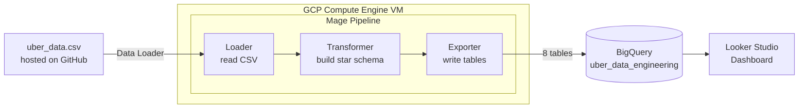
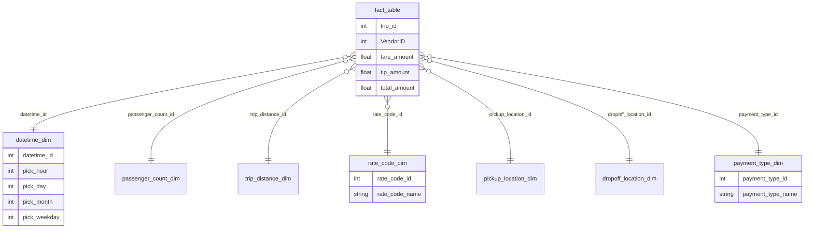

# 🚕 Uber Data Analytics - End-to-End Data Engineering Project

An end-to-end data engineering pipeline that ingests NYC taxi trip data, models it
into a **star schema**, orchestrates the ETL with **Mage** running on a **GCP Compute
Engine** VM, loads the results into **BigQuery**, and visualizes them in **Looker Studio**.

---

## 📌 Overview

Raw trip data starts as a flat CSV where every column (timestamps, passenger count,
distance, fares…) sits side by side. This project reshapes that into a dimensional
model built for analytics, then runs the whole thing as a cloud pipeline:

> **CSV (GitHub) → Mage (ETL on Compute Engine) → BigQuery (warehouse) → Looker Studio (dashboard)**

## 🏗️ Architecture



## 🧰 Tech Stack

| Layer          | Tool                                   |
| -------------- | -------------------------------------- |
| Language       | Python (pandas)                        |
| Orchestration  | [Mage](https://www.mage.ai/)           |
| Compute        | GCP Compute Engine (Ubuntu 22.04 VM)   |
| Data Warehouse | Google BigQuery                        |
| Visualization  | Looker Studio                          |
| Source Control | Git / GitHub                           |

## 📊 Dataset

NYC TLC **Yellow Taxi trip data** (~100,000-row sample). Each row is one trip, with
pickup/dropoff timestamps and coordinates, passenger count, trip distance, rate code,
payment type, and fare breakdown.

- `data/uber_data.csv` - the source data
- `data/Yellow_Taxi_Trip_Data_Data_Dictionary.xlsx` - official column definitions

## 🌟 Data Model (Star Schema)

The flat table is split into a central **fact table** (measurements + foreign keys)
surrounded by **dimension tables** (the descriptive attributes you filter/group by).



**Dimensions:** `datetime_dim`, `passenger_count_dim`, `trip_distance_dim`,
`rate_code_dim`, `pickup_location_dim`, `dropoff_location_dim`, `payment_type_dim`.

## 🔄 The Pipeline (Mage blocks)

1. **Data Loader** - reads `uber_data.csv` over HTTP from this repo.
2. **Transformer** - deduplicates, converts timestamps, and builds the 8 star-schema
   tables (see `uber-data-pipeline.ipynb` for the standalone version of this logic).
3. **Data Exporter** - writes each of the 8 tables into BigQuery.

## 🚀 Reproducing This Project

### 1. Prerequisites
- A GCP project with billing enabled (free-tier credit is enough)
- A BigQuery dataset (e.g. `uber_data_engineering`)

### 2. Spin up the VM
- Create a Compute Engine VM (`e2-standard-4`), **Ubuntu 22.04 LTS** boot image.
- Add a firewall rule allowing TCP `6789` (Mage's UI port).

### 3. Install & start Mage
```bash
sudo apt-get update
sudo apt-get install python3-pip -y
pip3 install mage-ai pandas google-cloud google-cloud-bigquery
mage start uber_project
```
Open `http://<VM_EXTERNAL_IP>:6789`.

### 4. Build the pipeline
Recreate the three blocks (Loader → Transformer → Exporter) using the code in this repo,
then run the pipeline. The 8 tables appear in BigQuery.

### 5. Authentication note (ADC, no key file)
This project authenticates to BigQuery using the VM's **attached service account**
(Application Default Credentials) rather than a downloaded JSON key - the exporter uses
`bigquery.Client()` with no explicit credentials. Grant the VM's service account the
**BigQuery Admin** role and ensure the VM has full Cloud API access scopes.

### 6. Analytics & dashboard
Query the star schema in BigQuery (busiest hours, revenue by payment type, average tip
by passenger count, etc.), then connect Looker Studio to BigQuery for the dashboard.

## 📁 Repository Structure

```
UberDEP/
├── data/
│   ├── uber_data.csv                              # source data
│   └── Yellow_Taxi_Trip_Data_Data_Dictionary.xlsx # column definitions
├── mage_blocks/
│   ├── load_uber_data.py                          # Loader block
│   ├── transform_uber_data.py                     # Transformer block (star schema)
│   └── export_to_bigquery.py                      # Exporter block (BigQuery)
├── uber-data-pipeline.ipynb                       # exploration + transformation logic
├── .gitignore
└── README.md
```

## 🔒 Security Note

No credentials or service-account keys are committed to this repo. Authentication is
handled entirely through the VM's attached identity (ADC).

---

*Built as a hands-on data engineering project covering ingestion, dimensional modeling,
cloud orchestration, warehousing, and BI.*
